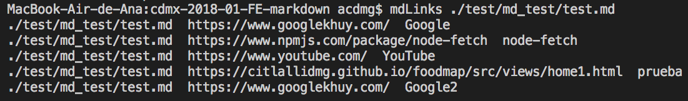

# md-links

School project that develop a Command line tool used to extract links from texts in markdown format and checks whether each link is alive (200 OK) or dead.

## Installation

To add the module to your project, run:

    npm install CitlalliDMG/md-links

To install the command line tool globally, run:

    npm install -g CitlalliDMG/md-links

If you get a permission error please try using sudo (you may need admin permissions depending on your node installation).

    # using `sudo` (only if the previous step failed)
    sudo npm i -g CitlalliDMG/md-links

Also if you want, you can install using a local clone.

    # clone from your own fork
    git clone git@github.com:<your-username>/md-links.git
    cd md-links
    npm install
    npm link

If the above command fails, try using sudo:

    sudo npm link

## API

### mdLinks(path, options)

Given a string path containing `markdown` formatted text extract all of the http links and check if they're alive or dead.

Parameters:

* `path` string containing the Absolute or relative path to the file or directory.
* `options` optional options object containing any of the following optional fields:
  * `validate` value that determines if you want to validate the links found in the file (boolean type, in CLI false by default).
  * `stats` value that determines if you want to calculate the stats of the links found in the file (boolean type, in CLI false by default).

### Command Line Tool

The command line tool by default expects one argument the file name (will soon accept directories) or either of the options --version or --help.

If a file name is supplied, the command line optionally takes 1 or 2 extra arguments (--validate or --stats)

If neither of the arguments is supplied, the tool displays the usage information.

#### Examples

*Check links from a local markdown file*



*Check links from a local markdown file and validate*


*Check links from a local markdown file and stats*


*Check links from a local markdown folder (recursive)*

    Soon

#### Usage

```

  Usage: mdLinks <path-to-file> [options]

  Options:

    --version           display version number of the package

    --validate          makes an HTTP request to find out if the link works or not,
                        showing in the output the path to the md file, the URL tested,
                        the response of the request and the status

    --stats             display basic statistics of the links found in the file (total and number of unique links)

    --help              output usage information

```

### Module

*Available soon*

## Testing

    npm test

## Checklist

### General

Que sea instalable directamente desde el repositorio de Github

- [X] `npm install --global <github-user>/md-links`

### `README.md`

- [X] Un board (project) con el backlog para la implementación de la librería.
- [X] Documentación técnica de la librería.
- [X] Guía de uso e instalación de la librería

### API `mdLinks(path, opts)`

- [ ] El módulo exporta una función con la interfaz (API) esperada.
- [X] Implementa soporte para archivo individual
- [ ] Implementa soporte para directorios
- [X] Implementa `options.validate`

### CLI

- [X] Expone ejecutable `md-links` en el path (configurado en `package.json`)
- [X] Se ejecuta sin errores / output esperado
- [X] Implementa `--validate`
- [X] Implementa `--stats`
- [X] Implementa `--validate --stats`

### Pruebas / tests

- [ ] Pruebas unitarias cubren un mínimo del 70% de statements, functions,
      lines, y branches.
- [X] Pasa tests (y linters) (`npm test`).
